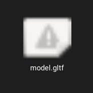
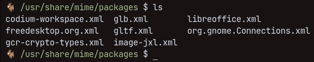

# The problem

I frequently work with 3D models in the web and therefore with .gltf or .glb files. These formats are the best choice for compressing and optimizing models for the web but they still seem to lack support in operating systems and their file managers. That is also the case for the preview icons. For example, that's how a .gltf file shows up in my file manager in Fedora 38 (Nautilus):



That's a very bad icon for files. It's blurry, shows a warning symbol and does not really represent the file contents.

I was wondering if it's possible to change icons for specific file types (also called MIME types) and as it turns out, it's possible on Linux!

## What to do

First, it's important to make the file extension known to the operating system. You can find existing custom definitions for all users in the `/usr/share/mime/packages` folder:



Notice the `gltf.xml` and `glb.xml` files? For every file type you want to add a custom icon to you need to add a corresponding `.xml` file. Let's look at the `glb.xml` file for reference:

```xml
<?xml version="1.0" encoding="UTF-8"?>
<mime-info xmlns='http://www.freedesktop.org/standards/shared-mime-info'>
	<mime-type type="model/gltf-binary">
                <comment>glTF Binary Format MIME Type</comment>
                <glob pattern="*.glb"/>
        </mime-type>
</mime-info>
```

The important part is the `<mime-type type="model/gltf-binary">` and the `<glob pattern="*.glb">` line. Add a new file and change the lines according to your MIME type and file extension and also name the file accordingly.

### Update the mime database

The next step is to update the mime database to give your defined MIME types to files ending with .glb or .gltf.  
You can do that with:

```bash
sudo update-mime-database /usr/share/mime
```

This will generate a folder with your MIME type xml definition in `/usr/share/mime/`, so for `.glb` and `.gltf` it will create the following files:

```bash
luca@carbon /usr/share/mime $ tree model
model
├── 3mf.xml
├── gltf-binary.xml
├── gltf+json.xml
└── ...

1 directory, 4 files
```

### Add the icons to your file types

The final step is getting your .svg icon ready and connect it to your MIME type. Copy your svg icon to `/usr/share/icons/hicolor/scalable/mimetypes/<mimetype-group>-<mimetype>.svg`. For .glb the mimetype-group would be `model` and the mimetype would be `gltf-binary`, resulting in this line for the whole filepath:

```bash
/usr/share/icons/hicolor/scalable/mimetypes/model-binary-gltf.svg
```

Now you just need to update your icon database with `sudo update-icon-caches /usr/share/icons/*` on Debian/Ubuntu or `sudo gtk-update-icon-cache /usr/share/icons/*` on Fedora. You may need to restart you system to get the icon to show up.